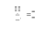

# ESP32STEPPER

current state: untested :warning:

inspired by [joshr120/PD-Stepper](https://github.com/joshr120/PD-Stepper) but being fully open hardware/software.

Stepper motor controller using silent Trinamic TMC2209, ESP32-S3 and USB-PD mountable onto any NEMA17 motor. 

## Main Features:
- **TMC2209** stepper motor driver
- **ESP32-S3**
  - alternatively NE555 pulse generator
- **USB Power Delivery** providing up to 20V operation
  - alternatively external voltage supply possible
- **MPU-6050** 6axis accelerometer
- **BME280** temperature sensor
- **QWIIC** connector for external I2C components
- 2x **WS2812** RGB LEDs
- 2x **Push Buttons**
- optional 0.96" 128x96 **LC-Display**
- **JTAG** pins accessible
- **3 GPIO** pins and **UART** available

## PCB - License CERN-OHL-P-2.0

### Schematic

### Bill of Materials

The complete BOM is available in different formats:
  - raw [HTML](pcb/docs/bom/esp32stepper-bom.html)
  - interactive [HTML](nerdyscout.github.io/esp32stepper)
  - [CSV](pcb/docs/bom/esp32stepper-bom_octopart.csv) compliant to octopart

### Layout

| Top                                            | Bottom                                               |
| ---------------------------------------------- | ---------------------------------------------------- |
|  |  |

### Gerbers

All fabrication files needed to produce this PCB are located within the [release package](https://github.com/nerdyscout/esp32stepper/releases).

## Mechanics

in the folder `cad` the spacers between motor and PCB, as well as the housing, can be found. One of the two spacer parts can be made out of metal to act as heatsink for the TMC2209. 

## Firmware

### ESPHome

There is a [esphome](https://esphome.io/) config file supporting different features located at `firmware/esphome`
