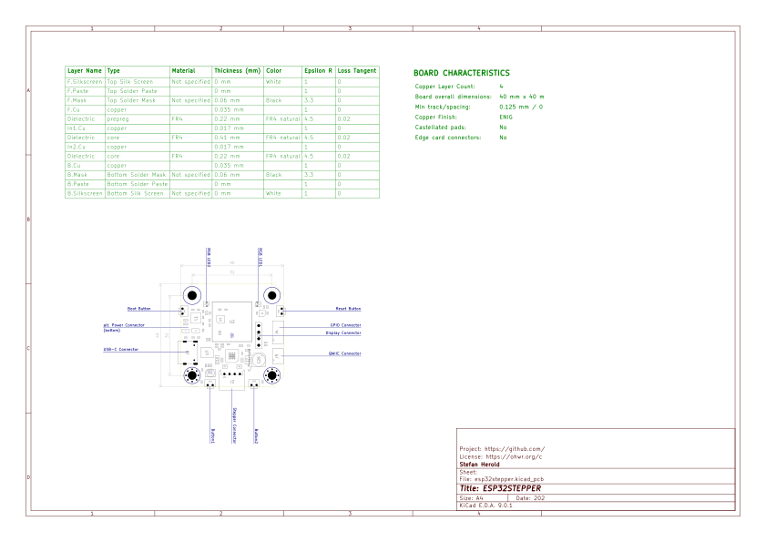

# ESP32STEPPER

current state: untested :warning:

inspired by [joshr120/PD-Stepper](https://github.com/joshr120/PD-Stepper) but being fully open hardware/software.

Stepper motor controller using Trinamic TMC2208, ESP32-S3 and USB-PD mountable onto any NEMA17 motor. 

## Main Features:
- **ESP32-S3**
  - alternatively a LM555 pulse generator can be used.
- **USB Power Delivery** providing up to 20V operation
  - alternatively 9-24 Volt external supply 
- **TMC2208** silent stepper motor driver
- optional
  - rotary encoder:
    - **AS5048B** 14-Bit angular position sensor
    - **MPU-9250** 9-axis motion sensor
  - 0.96" 128x96 **LC-Display**
  - **BME280** temperature sensor
  - **QWIIC** connector for external I2C components
  - **JTAG** pins accessible
  - **3 GPIO** pins and **UART** available
  - 2x **WS2812** RGB LEDs
  - 2x **Push Buttons**

## PCB

### Schematic

### Bill of Materials

The complete BOM is available in different formats:
  - interactive [HTML](https://nerdyscout.github.io/esp32stepper/pcb/docs/bom/esp32stepper-ibom.html)
<!--  - [octopart](pcb/docs/bom/esp32stepper-octopart.csv) -->
  - [Excel](pcb/docs/bom/esp32stepper-bom.xlsx)

### Fabrication

#### Layout

<table border="0" width="100%">
  <tr>
    <th><strong>Top</strong></th>
    <th><strong>Bottom</strong></th>
  </tr>
  <tr>
    <td></td>
    <td></td>
  </tr>
</table>

All fabrication files needed to produce this PCB are located within the [release package](https://github.com/nerdyscout/esp32stepper/releases).

#### Assembly Variants

There are two options to power this board, do not connect both at the same time!
- via connector *PWR* an **external 9-24 Voltage** can be applied which than also will be used to power the stepper motor. 
- **USB-PD** by setting the CFG pins a voltage is selected. This can be made either by assembling the resistors or in firmware of the ESP32.

There are as well two options for controlling the board:
- The **LM555** gives some basic PWM frequency driving the stepper controller. Instead of the external rotary encoder a potentiometer can be connected and choosing R15, R16 and C18 correctly should allow any stepping frequency.
- using the **ESP32-S3** gives much more options as it allows to utilize the I2C components (LC Display, accelerometer, temperature sensor), two RGB Leds and dynamically sets USB voltage.

Microstepping can be enabled by setting jumper MS1 and MS2.

## Mechanics

 

in the folder `cad` the spacers between motor and PCB, as well as the top housing, can be found. The spacer below the stepper controller should be made out of metal so it could act as heat sink, the other part can be simply 3D printed. If the external power connector is not assembled those two spacer parts could be manufactured with less hight, this brings the hall sensor closer to the magnet which needs to be glued onto the motor axis. 

## Firmware

### ESPHome

There is a [esphome](https://esphome.io/) config file supporting various features located at `firmware/esphome`
